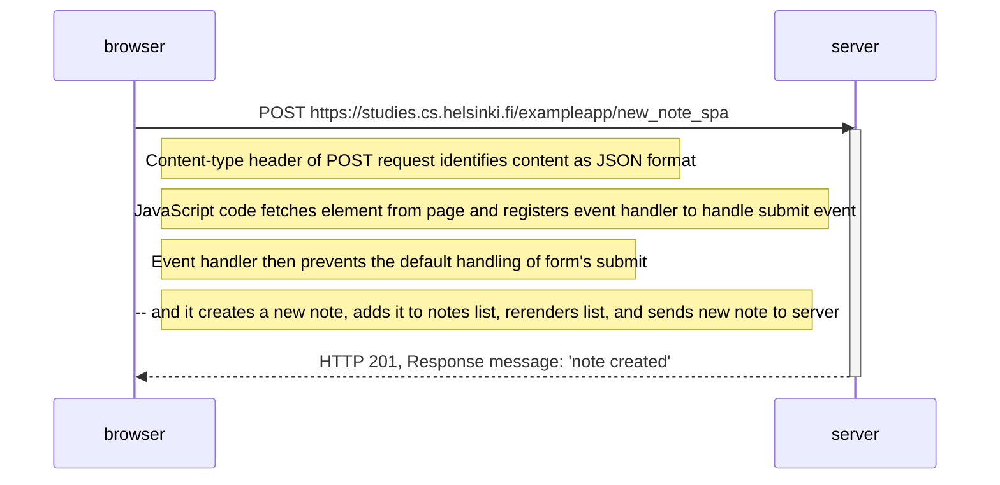

```mermaid
sequenceDiagram
    participant browser
    participant server

    browser->>server: POST https://studies.cs.helsinki.fi/exampleapp/new_note_spa
    activate server

    Note right of browser: Content-type header of POST request identifies content as JSON format
    Note right of browser: JavaScript code fetches element from page and registers event handler to handle submit event
    Note right of browser: Event handler then prevents the default handling of form's submit
    Note right of browser: -- and it creates a new note, adds it to notes list, rerenders list, and sends new note to server

    server-->>browser: HTTP 201, Response message: 'note created'
    deactivate server

```
